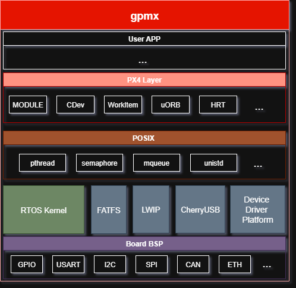

GPM is a microcontroller project template that integrates open-source components

### gpmx Architecture



## directory Structure

| Directory | Description                     |
| --------- | ------------------------------- |
| boards    | chip library and boards support |
| include   | components header files         |
| libs      | components souces files         |
| make      | build makefiles and srcipts     |
| kernel    | kernel of rtos                  |
| px4       | px4 sdk layer, and modules      |

## toolchain

Edit Toolchain path in ./make/toolchain.sh:

```bash
armgcc_path=
openocd_path=
armcc_path=
armclang_path=
```

compile:

```bash
./make/build.sh app_template -j2 -r
```

## integrate Peripheral Driver Support

STM32 :

|           | F1           | F4 | H7 | WL |
| --------- | ------------ | -- | -- | -- |
| GPIO/EXTI | **√** | √ | √ | √ |
| RTC       | √           | √ | √ | × |
| USART     | √           | √ | √ | √ |
| I2C       | √           | √ | √ | × |
| SPI       | √           | √ | √ | × |
| CAN       | √           | √ | × | × |
| ETH       | √           | √ | × | × |
